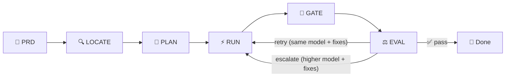

# 🐀 Splinter

**One model plans. Cheaper models do the work. A judge decides when to level up.**

Splinter is a multiagent coding harness built on one stubborn idea: you should
not be paying frontier prices to write a hello world. A smart, expensive model
should act like a sensei (plan the work, pick the right student, and only step
in when the students fail). Everything else runs on cheap, fast models until
proven otherwise.



**How the loop works:**

1. **PRD** — you describe what needs to be built
2. **LOCATE** — two phases: a cheap flash model does broad recall (grep, ctags, LSP, AST) to find every plausible candidate, then a mid model does precise filter to confirm relevance and emit a clean list of `file, symbol, reason`
3. **PLAN** — the sensei reads the map and writes the plan. This happens **once** per session
4. **RUN** — a student model receives the plan (or the plan + corrections from a previous eval) and implements
5. **GATE** — deterministic checks run first (compile, test, lint, typecheck). If it breaks here, no expensive judge is called
6. **EVAL** — the judge evaluates the output against acceptance criteria and returns what needs to be fixed

If the eval fails, it returns the necessary corrections. The runner gets those fixes and tries again in the same session, reading from the session memory to avoid re-discovering context. On **retry**, the same model tries again with the corrections. On **escalate**, a higher model on the ladder takes over — but it still goes straight to RUN with the fixes, not back to PLAN.

The loop continues until the judge is satisfied or you hit `opus-4.8` at the top of the ladder.

---

## Quickstart

Create a PRD interactively, then run it. `splinter prd` asks a few lettered
questions (including which turtle to use), writes the PRD into the session, and
records the strategy in its frontmatter:

```bash
# describe the work; answer the clarifying questions it asks
uv run splinter prd "add priority levels to tasks"

# the strategy lives in the PRD, so run just points at it
uv run splinter run --prd .splinter/sessions/<id>/prd.md
```

For a quick single task without a full PRD, the `direct` strategy takes a task
file straight away:

```bash
uv run splinter run --strategy raphael --task task.yaml
```

```yaml
# task.yaml
description: "write a hello world in python and run it"
acceptance: "the script runs with exit 0 and prints something containing 'hello'"
eval_skill: "run_python"   # runs the script, captures stdout and exit code
effort: trivial            # task difficulty, sets the starting tier
reasoning_effort: auto     # how hard the model thinks, or let the agent decide
suggested_tier: 0
```

The `run_python` skill just executes the generated file with the project
interpreter (`uv run python <file>`), so the first task needs zero extra
toolchains beyond what setup already verified.

That run will: ask the sensei for a plan, hand it to a flash tier model, let it
create the folder, write the Rust, compile and execute, then let the judge
confirm the output. If the cheap model trips, Splinter quietly levels up and
tries again.

---

## Requirements

Splinter is the conductor, not the models. You bring the two CLIs it drives:

- **[uv](https://github.com/astral-sh/uv)** the Python project manager Splinter
  is built on
- **Python 3.11+** (uv can install it for you)
- **[Claude Code](https://docs.claude.com/en/docs/claude-code/overview)** the
  `claude` CLI, authenticated, with access to `sonnet` and `opus-4.8`
- **[opencode](https://opencode.ai)** the `opencode` CLI, authenticated on the
  `opencode-go` provider _(not needed if you use `--use-cc-only`, see below)_
- **[Codex](https://chatgpt.com/codex)** the `codex` CLI, authenticated with
  your OpenAI account _(optional — only needed for Codex-based runners)_

No extra language toolchains required. The validation tasks are all Python, which
uv already gives you.

## Setup

### Option 1 — install with uv (recommended)

If you already have [uv](https://github.com/astral-sh/uv):

```bash
uv tool install git+https://github.com/evertontomalok/splinter.git
```

That is it. The `splinter` command is now available globally.

<details>
<summary>Don't have uv yet?</summary>

```bash
curl -LsSf https://astral.sh/uv/install.sh | sh
```

</details>

### Option 2 — clone and install locally

```bash
git clone https://github.com/evertontomalok/splinter.git
cd splinter
uv sync
```

With a local install, prefix every command with `uv run` (e.g. `uv run splinter setup`).

### Authenticate the providers (one time)

```bash
claude            # sign in to Claude Code
opencode auth login
```

**If you also want Codex runners**, install and sign in:

```bash
curl -fsSL https://chatgpt.com/codex/install.sh | sh
codex            # opens browser — sign in with your OpenAI account
```

### Let opencode edit files non-interactively (one time)

```bash
mkdir -p ~/.config/opencode
cat > ~/.config/opencode/opencode.json <<'JSON'
{
  "permission": {
    "edit": "allow"
  }
}
JSON
```

### Verify everything is wired up

```bash
splinter setup        # or: uv run splinter setup (local install)
```

The disciples write code by editing files directly. opencode needs
`permission.edit: allow` in `~/.config/opencode/opencode.json` (step 3) so it can
do that without prompting; Splinter also passes `--agent build` and
`--dangerously-skip-permissions`, and drives `claude -p` with
`--dangerously-skip-permissions`.

`splinter setup` does not just check the binaries exist, it pings each provider
for real:

```
checking providers...
  claude -p (sonnet) ..... OK
  opencode models ........ OK (14 models)
  ladder vs roster ....... OK
  python (uv run) ........ OK (3.11.x)
environment ready.
```

If a provider is missing or not authenticated, setup tells you exactly which one
and exits non zero, so you can drop it in CI too.

---

## Running with Claude Code only

No opencode account? Pass `--use-cc-only` to switch Splinter to a Claude-only
ladder. Everything runs through `claude -p` — no opencode binary needed, no
`opencode auth login`, no `opencode.json`.

```bash
splinter configure --use-cc-only
```

The ladder becomes:

| Tier | Role | Model |
|------|------|-------|
| T0 / T1 | easy → moderate | `haiku` |
| T2 / T3 | moderate-hard → hard | `sonnet` |
| T4 / T5 | critical → last-resort | `opus` |

Localizer and eval also run on `haiku` and `opus` respectively. Same pipeline,
same strategies, same judge loop — just no open models.

When you want to switch back to the full opencode roster:

```bash
splinter configure --use-default
```

Minimal setup for Claude-only mode:

```bash
claude                          # sign in (one time)
splinter configure --use-cc-only
splinter setup
```

---

## Manual configuration

`splinter configure` (no flags, run in a terminal) opens an interactive TUI to
pick per-step models and effort levels and writes the result to
`.splinter/config.yaml`.

For non-interactive use, pass flags directly:

```bash
# set the per-call model timeout (default 3600 s)
splinter configure --timeout 7200

# replace the gate check suite with your own commands (comma-separated)
splinter configure --gate-checks "pytest,ruff check,mypy splinter"

# scaffold editable prompt templates into .splinter/prompts/
splinter configure --init-prompts

# overwrite existing templates
splinter configure --init-prompts --force

# skip the TUI even in a terminal
splinter configure --no-interactive --timeout 3600
```

All of these write to `.splinter/config.yaml` in your project. You can also edit
that file directly — it is plain YAML:

```yaml
defaults:
  strategy: cascade
  effort: auto
  max_iterations: 5
  timeout: 3600
  budget: null          # USD cap; null = no limit

gate_checks:
  - {name: pytest,  cmd: "uv run pytest",        when: tests_exist}
  - {name: ruff,    cmd: "uv run ruff check",    when: always}
  - {name: mypy,    cmd: "uv run mypy splinter", when: always}

models:
  planner: opus
  eval: opus
  localizer_recall: haiku
  localizer_precision: haiku
  tiers: [haiku, haiku, sonnet, sonnet, opus, opus]

efforts:
  planner: high
  eval: high
  tiers: [high, max, high, max, high, max]
```

A user-level config at `~/.splinter/config.yaml` is also supported — project
config takes precedence when both exist.

---

## Supported Models

Splinter routes work through three provider families. You pick which to use (or all
three) in your ladder configuration.

### Claude (via `claude -p`)

Frontier models with optional reasoning. Used for planning, evaluation, and as a
fallback escalation tier.

| Model | Effort levels | Reasoning | Context |
|-------|---------------|-----------|---------|
| `opus-4.8` | `low`, `high`, `max` | Extended thinking | 200K tokens |
| `sonnet` | `low`, `high`, `max` | Extended thinking | 200K tokens |
| `haiku` | `low`, `high` | Fast reasoning | 200K tokens |

### Opencode (open models via `opencode-go`)

A rotating roster of open models. Effort level support varies by model (check
`opencode models` for current availability). Most common: `high` (standard) and
`max` (extended reasoning).

| Tier | Model | Common efforts |
|------|-------|----------------|
| T0 | `deepseek-v4-pro` | `low`, `high` |
| T1 | `minimax-m3` | `low`, `high`, `max` |
| T3 | `deepseek-v4-pro` | `low`, `high`, `max` |
| T4 | `qwen3.7-plus` | `low`, `high`, `max` |

See `splinter configure` to swap models or `opencode models` to list available
models and their current capabilities.

### Codex (via `codex` CLI)

Specialized coding model from OpenAI, optimized for multi-file code tasks.

| Model | Effort levels | Pricing | Notes |
|-------|---------------|---------|-------|
| `gpt-5-codex` | `low`, `medium`, `high` | $10 input / $40 output (per 1M tokens) | Requires OpenAI account; install with `curl -fsSL https://chatgpt.com/codex/install.sh \| sh` |

Model IDs use the `codex/` prefix: e.g. `codex/gpt-5-codex` in config or CLI.

Effort aliases: `minimal` → `low`, `xhigh` / `max` → `high`, `auto` → agent decides.

---

## Commands

| Command | Description |
|---------|-------------|
| `splinter setup` | Verify environment — checks both CLIs, pings each provider, validates the ladder |
| `splinter prd [description]` | Generate a PRD interactively (Q&A with the sensei) |
| `splinter run` | Run a task or PRD through a strategy |
| `splinter resume [session]` | Resume a session — PRD refinement, or a failed/interrupted run |
| `splinter analyze` | Inspect a session in an interactive TUI |
| `splinter configure` | Pick per-step models in a TUI, then write `config.yaml` |

### `splinter run`

```
splinter run [OPTIONS]
```

| Option | Description |
|--------|-------------|
| `--strategy TEXT` | Strategy name or turtle alias (`cascade`/`leonardo`, `direct`/`raphael`, `adaptive`/`donatello`, `sprint`/`michelangelo`) |
| `--prd TEXT` | Path to `prd.md` |
| `--task TEXT` | Path to `task.yaml` (for `direct` strategy) |
| `--effort TEXT` | Override reasoning effort (`trivial`, `normal`, `hard`, `critical`) |
| `--budget FLOAT` | Max cost cap in USD |
| `--max-iterations INT` | Max loop iterations (default: 5) |
| `--eval TEXT` | Override eval skill |
| `--eval-model TEXT` | Override evaluator model |
| `--eval-effort TEXT` | Override evaluator reasoning effort |
| `--cowabunga` | Full autonomy — skip PRD Q&A, never stop on `ASK_USER` |
| `--no-ground` | Skip codebase grounding before PRD Q&A |
| `--quiet` | Plain log output instead of the live TUI |
| `--use-cc-only` | Swap to Claude-only runners before running |

### `splinter prd`

```
splinter prd [description]
```

| Option | Description |
|--------|-------------|
| `description` | Feature or bug description (passed inline or typed interactively) |
| `--strategy TEXT` | Pre-select strategy, skips that question in Q&A |
| `--no-ground` | Skip codebase grounding before PRD Q&A |

### `splinter resume`

```
splinter resume [session]
```

Transient failures continue from where they stopped; critical failures roll back the failing stage and redo it.

| Option | Description |
|--------|-------------|
| `session` | Session ID to resume (default: latest in-progress session) |
| `--reset` | Re-run from the head — fresh localize + plan |
| `--use-cc-only` | Swap to Claude-only runners before resuming |

### `splinter analyze`

```
splinter analyze [OPTIONS]
```

| Option | Description |
|--------|-------------|
| `--session TEXT` | Session ID (default: most recent) |
| `--watch` | Live-refresh until the run finishes |
| `--expand [plan\|loop\|eval\|localization\|trace\|agentic\|all]` | Print a step's full markdown one-shot |
| `--no-interactive` | Static overview instead of the TUI |

### `splinter configure`

```
splinter configure [OPTIONS]
```

| Option | Description |
|--------|-------------|
| `--use-cc-only` | Switch to Claude-only ladder (`haiku` / `sonnet` / `opus`) |
| `--use-default` | Switch back to the full opencode roster |
| `--timeout INT` | Set per-call model timeout in seconds (default: 3600) |
| `--gate-checks TEXT` | Replace gate check suite (comma-separated commands) |
| `--init-prompts` | Scaffold editable prompt templates into `.splinter/prompts/` |
| `--force` | Overwrite existing prompt templates |
| `--no-interactive` | Skip the TUI even in a terminal |

---

## The problem

Most agent setups burn a top tier model on every single step. Planning,
boilerplate, retries, evaluation... all at the same eye watering per token rate.
It works, but it is like hiring a master chef to butter your toast.

## The idea

Splitter splits the brain from the hands.

- 🧠 **The sensei** (`opus-4.8` or `sonnet` via `claude -p`) reads your PRD and
  writes the plan. Once. Up front.
- 🐢 **The students** (15+ open models via `opencode-go`) do the actual typing,
  starting from the cheapest one that can plausibly handle the task.
- ⚖️ **The judge** checks the output against acceptance criteria. If a cheap
  model flails, the judge climbs the ladder: `qwen -> sonnet -> sonnet max -> opus-4.8`.

You only pay for intelligence when the work actually demands it.

## Cheap models do the legwork, the expensive one just thinks

The real trick is what happens *before* planning. Splinter does not dump your repo
(or a generic RAG blob) into the expensive model's context. Instead, fast cheap
models build a tight map of exactly where the work needs to happen:

1. **Broad recall** (a flash model) drives the real code tools (grep, ctags, LSP,
   AST) to list every plausible candidate. Coverage over precision.
2. **Precise filter** (a mid model) confirms relevance and emits a clean list of
   `file, symbol, reason`.

The expensive planner then opens with that map already in hand. It does not go
spelunking through your codebase burning frontier tokens. It reasons about a small,
dense, high signal context and writes tasks that point straight at the right files.
Think of it as RAG, but the retrieval is done by LLMs steering actual code tooling
instead of embedding similarity.

```
PRD  ->  LOCATE (recall -> precision)  ->  PLAN  ->  RUN  ->  GATE  ->  EVAL  ->  🔁
```

Two more things make the loop cheap and honest: a **deterministic gate** (compile,
test, type check, lint, build) runs before the expensive judge, so mechanical
breakage never wastes a judgment call. And the **judge runs on a different model
family** than the one that wrote the code, so it never just rubber stamps its own
work.

## Session memory is what makes it cheap

Every run keeps a local memory folder of plain markdown files
(`.splinter/sessions/<id>/`). The localization map, the plan, what each loop tried,
what the gate broke on, every eval verdict... all written to disk as `.md`.

Why markdown, why on disk: the whole point of Splinter is spending fewer tokens.
Without persisted memory, every loop re-discovers context (re-runs the localizer,
re-reads files, re-explains what already failed) and burns exactly the tokens the
project promises to save. Memory turns "discover it again" into "read a markdown
file." A small `index.md` is read first as a cheap map, so a model opens only the
one file it needs instead of paying to rebuild context.

The localizer (LLM steering code tools, plus a local RAG index) writes its findings
here too, so the expensive planner reads a ready made map instead of re-scanning the
repo on every iteration.

## Watch a run from another shell

```bash
uv run splinter analyze            # most recent session
uv run splinter analyze --session <id>
```

Because the state lives in those markdown files, `analyze` barely touches an LLM. It
reads the session memory off disk and prints where things stand: current step, which
model is running, what passed or failed, cost so far.

---

## Meet the squad

Four strategies, four personalities. Each has a formal name (what you pass to
`--strategy`) and a turtle alias (also accepted). Same pipeline, different attitude.

| Strategy | Turtle | Vibe |
|----------|--------|------|
| `cascade` | 🔵 **Leonardo** | Discipline. Breaks a big PRD into many tiny tasks, runs them in order, checkpoints as it goes. |
| `direct` | 🔴 **Raphael** | Attitude. One task, implement, evaluate, loop hard, escalate fast. Gets it done. |
| `adaptive` | 🟣 **Donatello** | Brains. Estimates effort per task, routes to the cheapest capable model, respects a budget. |
| `sprint` | 🟠 **Michelangelo** | Chill. Always starts on flash tier, short loops, bails up a tier the moment it stalls. |

So `--strategy cascade` and `--strategy leonardo` are the same thing.

---

## The escalation ladder

Splinter never starts at the top. It earns its way there.

No weak models on the bench — the floor is already capable.

| Tier | Name | Effort flag | Model | Runner | Reasoning | Recommended for |
|------|------|------------|-------|--------|-----------|-----------------|
| T0 | easy | `trivial` | deepseek-v4-pro | opencode | low | Boilerplate, scaffolding, trivial edits |
| T1 | moderate | `normal` ⭐ | minimax-m3 | opencode | high | Most tasks — features, bug fixes, refactors |
| T2 | moderate-hard | *(escalation only)* | deepseek-v4-pro | opencode | high | T1 stalled; max reasoning before model swap |
| T3 | hard | `hard` | deepseek-v4-pro | opencode | max | Complex logic, multi-file changes |
| T4 | critical | `critical` | qwen3.7-plus | opencode | high | Architecture changes, gnarly migrations |
| T5 | last-resort | *(escalation only)* | sonnet | claude -p | max | Open models failed; Claude as final fallback |

⭐ default — `normal` effort starts here.

The plan tags each task with an effort hint that sets the starting tier. T2 and T5 are escalation-only — they are never a starting point. The judge owns the climb from there.

**Localizer roster** (separate from execution): recall/search runs on
deepseek-v4-flash, escalating to **minimax-m3** for its huge context window on
large repos; **deepseek-v4-flash** qualifies and filters the candidate locations.

---

## Two kinds of effort

Splinter separates **task difficulty** from **reasoning effort**.

- `effort` (task difficulty) picks the starting tier.
- `reasoning_effort` controls how hard the chosen model thinks. On open models it
  maps to `opencode run --variant <minimal|high|max>`. On Claude it maps to the
  equivalent `claude -p` effort control.

You can set it three ways: an explicit `--effort` flag wins, otherwise the
planner annotates each task, otherwise `reasoning_effort: auto` lets the agent
decide. Valid effort levels are read straight from the CLI, so when a new model
lands on `opencode-go` with different levels, Splinter adapts with no code change.

---

## 🤙 `--cowabunga` mode

By default, when the judge hits something genuinely critical (destructive
actions, architecture forks, blowing the budget) it stops and asks you, the
sensei.

Pass `--cowabunga` and the turtles stop waking the old man up. Full autonomy,
critical calls included. Powerful, occasionally chaotic, exactly as the name
suggests.

```bash
uv run splinter run --strategy raphael --prd prd.md --cowabunga
```

---

## How the judge thinks

Every loop, the evaluator returns one of five verdicts:

- ✅ `PASS` acceptance met, task done
- 🔄 `RETRY` recoverable miss, same model, try again
- ⬆️ `ESCALATE` this model cannot do it, climb one tier
- 🚀 `JUMP_PREMIUM` skip the line, go straight to sonnet max or opus-4.8
- 🙋 `ASK_USER` too important to guess, hand it to the human (unless `--cowabunga`)

Evaluation runs two ways: a written acceptance check, or a real skill/script
(think `go test` or a custom validator) plus a judgment on top.

---

## Why it is different

- **Cost aware by design.** Cheap first, expensive only when proven necessary.
  Every step logs its own token count and cost.
- **Bring your own ladder.** The tiers and escalation rules live in a single
  `ladder.yaml`. Reorder, swap models, set your own jump points.
- **Two CLIs, one brain.** Premium thinking through `claude -p`, a deep bench of
  open models through `opencode-go`, unified behind one pipeline.
- **Pick your fighter.** Long marathon or quick brawl, same harness, one flag.

---

## Status

Early and moving fast. The core loop (plan with the sensei, execute with a
student, evaluate, escalate) already runs end to end. Strategies and the
budget aware router are landing next.

Cowabunga. 🐢
